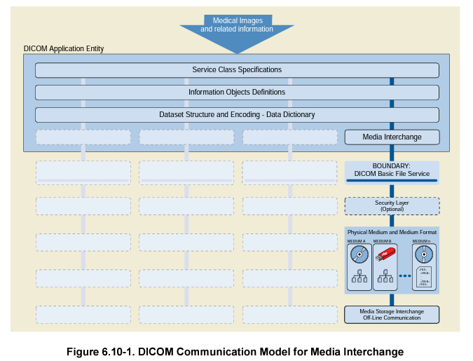

<h1>PS3.1</h1>

<h2>소개 및 개요(Introduction and Overview)</h2>

> <h3>Notice and Disclaimer</h3>
>
> - NEMA : The National Electrical Manufacturers Association
> - NEMA에서 본 내용을 준수하도록 감시하거나 강제하지 않습니다.

> <h3>Foreword</h3>
>
> - DICOM 표준 위원회는 의료 영상 정보 및 관련 데이터의 표준화에 관심을 갖는 조직입니다.
> - DICOM 표준 위원회의 사무국은 NEMA와 그 곳의 의료 영상 기술 동맹 부서입니다.
> - DICOM 표준은 위원회의 주요 제품입니다.
> - 본 표준은 NEMA 표준 PS3로 발행되며, NEMA 간행물(PS3.1, PS3.2 등)의 번호로 식별됩니다.

> <h3>1. 어플리케이션의 범위 및 분야</h3>
>
> - PS3.1은 전체 DICOM(Digital Imaging and Communications in Medicine) 표준에 대한 개요를 제공합니다.
>
> - PS3.1에서는 이 표준의 각 부분의 내용에 대한 간략한 설명이 포함됩니다.
>
>   
>
>   
>
>   <h4>1.1 DICOM의 범위 </h4>
>
>   - DICOM은 의료 영상 정보 및 관련 데이터의 통신 및 관리를 위한 표준입니다.
>   - DICOM 표준은 다음을 지정하여 의료 영상 장비의 상호 운용성을 향상시킵니다.
>     - 네트워크 통신의 경우, 표준 준수를 주장하는 장치가 따라야 하는 프로토콜 집합
>     - 미디어 통신에서 일련의 미디어 저장 서비스와 저장된 이미지 및 관련 정보에 대한 액세스를 용이하게 하는 파일 형식 및 의료 디렉터리 구조
>     - 표준을 준수하는 구현을 진행할 때, 함께 제공되어야 하는 정보
>   - DICOM 표준은 다음을 지정하지 않습니다.
>     - 표준 기능의 구현 세부사항
>     - 구현된 시스템에서 기대할 수 있는 전체 기능 세트
>     - 적합성 평가를 위한 시험/검증 절차
>
>   
>
>   
>
>   <h4>1.2 적용 분야</h4>
>
>    DICOM 표준은 의료 정보학 분야와 관련하여 의료 영상 장비와 다른 시스템 간의 디지털 정보 교환을 다룹니다. 그러한 장비들은 다른 의료기기 및 정보 시스템과 상호 운용될 가능성이 높기 때문에, 이 표준의 적용범위는 의료정보학의 다른 영역과 중복될 필요가 있습니다. 하지만 DICOM 표준에서는 해당 범위에 대해 직접 다루지 않습니다.
>
>   
>
>    이 표준은 진단 의료 영상과 영상 기반 치료에 중점을 두고 개발되었습니다. 그러나 임상, 연구, 수의학 및 기타 의료 환경에서 교환되는 광범위한 영상 및 비영상 관련 정보에도 적용할 수 있습니다.
>
>   
>
>   
>
>   <h4>1.3 이력</h4>
>
>    1970년대에 CT가 도입되고, 디지털 진단 영상 양식의 도입으로 임상 애플리케이션에서 컴퓨터 사용이 증가하면서 ACR과 NEMA는 표준에 대한 필요성에 대해 인식했습니다.
>
>   
>
>    1983년 ACR과 NEMA는 다음을 위한 표준을 개발하기 위해 공동 위원회를 구성했습니다.
>
>   - 장치 제조업체에 관계없이 원활한 디지털 이미지 정보의 통신 촉진
>   - 다른 병원 정보 시스템과도 상호 작용할 수 있는 사진 보관 및 통신 시스템(PACS)의 개발 및 확장 촉진
>   - 위치적으로 분산된 다양한 장치에서 조회할 수 있는 진단 정보 데이터베이스
>
>   
>
>    1985년에 ACR-NEMA 표준 공개번호 300-1985는 버전 1.0으로 지정되었습니다. 이 표준 간행물들은 하드웨어 인터페이스, 최소 소프트웨어 명령어 집합 및 일관된 데이터 형식 집합을 지정하였습니다.
>
>   
>
>    1988년에 ACR-NEMA 표준 공개번호 300-1988은 버전 2.0으로 지정되었습니다. 버전 1.0, 공개된 개정판, 추가 개정판이 포함되며, 디스플레이 장치에 대한 명령을 지원하고, 이미지를 식별하기 위한 새로운 계층 구조를 도입하고, 이미지를 설명할 때 데이터 요소를 추가하기 위한 새로운 자료를 포함합니다.
>
>   
>
>    1933년 ACR-NEMA 표준 300이 실질적으로 개선되어 이 표준으로 대체되었습니다. 이전 버전에 대한 몇 가지 주요 개선 사항입니다.
>
>   - 네트워크 환경에 적용할 수 있습니다. DICOM은 업계 표준 네트워킹 프로토콜 TCP/IP를 사용하여 네트워크 환경에서 작동할 수 있도록 지원합니다.
>   - ACR-NEMA 표준은 파일 형식이나 물리적 미디어 또는 논리적 파일 시스템의 선택을 지정하지 않았습니다. DICOM은 CD-R, USB와 같은 업계 표준 미디어와 공통 파일 시스템을 사용한 오프라인 미디어 환경에서의 작동을 지원합니다.
>   - 이것은 서비스 지향 프로토콜로, 명령어와 관련 데이터의 의미와 표준 준수를 주장하는 장치가 교환되는 명령어와 데이터에 어떻게 반응하는지를 명시한다. 지정된 서비스에는 이미징 부서의 워크플로우 관리 지원이 포함됩니다. ACR-NEMA 표준은 암묵적인 서비스 요구사항만을 가진 데이터 전송으로 제한되었습니다.
>   - 준수해야하는 수준을 지정합니다. DICOM은 특정 옵션을 선택하기 위해 구현자가  준수에 대한 보고서를 구성하는 방법을 명시적으로 설명합니다.
>
>   
>
>    1995년, ACR-NEMA 공동 위원회는 모든 의료 영상 전문 분야에 걸쳐 이해 관계자들의 광범위한 협력인 DICOM 표준 위원회로 개편되었습니다.
>
>   
>
>   
>
>   <h4>1.4 Principles</h4>
>
>   <h5>1.4.1 글로벌 적용 가능성 및 현지화</h5>
>
>    DICOM은 모든 로케일에서 사용할 수 있는 전 세계 표준입니다.  다양한 종류의 데이터를 처리하는 메커니즘을 제공합니다.  여러 분야의 의학적 이미징에 사용되는 다양한 워크플로우, 프로세스 및 정책을 지원합니다.
>
>     국가 또는 지역 보건 및 워크플로우 정책의 요구사항을 충족하기 위한 현지화는 표준을 벗어나지 않고 수행할 수 있습니다. 
>    
>     현지화 및 프로파일링은 DICOM 표준의 범위 밖에 있는 여러 메커니즘에서 지정할 수 있습니다. 이러한 메커니즘 중 하나는 IHE(Integrating the Healthcare Enterprise) 조직의 통합 프로필입니다.  프로파일링은 모순되지 않는 개념을 고수하는 것이 중요합니다. 프로파일은 요구 사항을 추가할 수 있지만 DICOM 요구 사항과 모순되지 않아야 합니다. 모순되면, DICOM과 프로파일을 모두 준수할 수 없습니다.
>
>   
>
>   
>
>   <h5>1.4.2 지속적인 유지보수</h5>
>
>    DICOM 표준은 DICOM 표준 위원회의 절차에 따라 유지 관리됩니다. 개선을 위한 제안은 이 표준의 모든 사용자로부터 환영을 받고, 사무국에 제출될 수 있습니다.
>
>    기준서를 업데이트할 때 요구사항은 이전판과의 효과적인 호환성을 유지하는 것입니다.
>
>    
>
>   
>
>    <h5>1.4.3 정보 객체 및 고유 객체 식별</h5>
>
>    대부분의 DICOM 서비스에는 이미지와 같은 영구 Information Object의 교환이 포합됩니다. 이러한 정보 객체의 인스턴스는 많은 시스템과 많은 조직 컨텍스트에서 시간이 지남에 따라 교환될 수 있습니다. 특정 조직 내에서 처리를 용이하게 하기 위해 인스턴스의 속성을 약간 변경할 수 있지만(예: 로컬 컨텍스트에서 사용되는 값으로 환자 ID를 강제함으로써) 인스턴스의 의미론적 내용은 변경되지 않는다.
>
>    각 인스턴스는 전체적으로 고유한 개체 식별자로 식별되며, 이 식별자는 모든 교환에서 인스턴스에 지속됩니다. 인스턴스의 의미론적 내용에 대한 변경사항은 새 인스턴스를 생성하도록 정의되며, 이 인스턴스는 전역적으로 고유한 새 개체 식별자가 할당됩니다.
>
>   
>
>   
>
>    <h5>1.4.4 적합성</h5>
>
>    DICOM 표준 준수는 Information Object의 유형(CT or MR 이미지)에서 작동하는 서비스(네트워크, 미디어 또는 웹을 사용하는 스토리지 등)를 나타내는 SOP(Service-Object Pair) 클래스로 명시됩니다. 
>
>     DICOM 표준의 SOP 클래스 사양은 모든 버전의 표준에 대해 이전 버전과 이전 버전이 호환되도록 설계된 방식으로만 변경됩니다. 따라서 적합성 요구사항 및 적합성 클레임은 SOP 등급의 식별자를 참조하며, 표준에디션을 참조하지 않습니다.
>
>    <u>각 구현은 일관된 형식 구조에 따라 상호운용성을 위한 제품 비교를 용이하게 하는 적합성 설명서를 제공해야 합니다.</u>
>
>   
>
>   
>
>   <h5>1.4.5 정보 모델의 일관성</h5>
>
>    DICOM 표준에 정의된 많은 Information Object는 환자, 스터디, 영상 시리즈, 장비, 기준 프레임 및 특정 인스턴스 데이터 유형을 나타내는 정보 엔티티와 함께 일반적인 복합 정보 모델을 따릅니다. <u>이 정보 모델은 의료 영상의 실제 개념과 활동을 단순화한 것입니다.</u> 
>
>    <u>DICOM에 정의된 새 Information Object는 일반적으로 이 기존의 공통 정보 모델을 준수하므로 새 개체를 지원하기 위해 최소한의 변경 사항으로 구현을 재사용할 수 있습니다. -> 공통 정보 모델 준수의 필요성</u>
>
>   

><h3>2. 표준 참조</h3>
>
>--생략
>
>

><h3>3. 정의</h3>
>
>- Attribute - Information Object의 속성입니다. 속성에는 인코딩 체계와 독립적인 이름과 값이 있습니다.
>
>- Command - 네트워크를 통한 정보에 대한 작업 요청.
>
>- Command Element - An encoding of a parameter of a command that conveys this parameter's value
>
>- Command Stream - DICOM 인코딩 체계를 사용하여, DICOM Command Elements의 집합을 인코딩한 결과
>
>- Conformance Statement - DICOM 표준의 특정 구현을 설명하는 공식 statement.  해당 구현에서 지원하는 서비스 클래스들, Information Object, 통신 프로토콜, 보안 개요 및 미디어 저장 어플리케이션 개요를 설명합니다.
>
>- Data Dictionary - 각 데이터 요소에 대한 고유 태그, 이름, 값 특성 및 의미를 지정하는 DICOM 데이터 요소의 저장. 
>
>- Data Element - Data Dictionary안에 단일 항목으로 정의된 정보 단위.
>
>- Data Set - 구조화된 속성 집합으로 구성된 교환된 정보. Data Set의 각 속성 값은 Data Element로 표시.
>
>- Data Stream - DICOM 인코딩 체계(Data Dictionary에 지정된 Data Element의 번호 및 표현)를 사용하여 Data Set을 인코딩한 결과.
>
>- Information Object - 하나 이상의 DICOM Commands에 의해 동작되는 실제 정보 엔티티(예: CT Image, Structured Report 등)의 an abstraction.     (참고: 이 용어는 주로 PS3.1에서 사용되며, PS3.3에서 몇 번 참조됩니다. PS3.3에 도입된 공식 용어에 상응하는 비공식 용어입니다. DICOM 표준의 다른 모든 부분에서는 이 용어를 Information Object Definition이라고 합니다.)
>
>- Information Object Class - Information Object에 대한 정규 표현으로, Information Object의 목적과 Information Object가 소유한 속성에 대한 설명을 포함. 이 속성에 대한 값은 포함되지 않습니다.     (참고: 이 용어는 PS3.1에서만 사용됩니다. PS3.4에 도입된 공식 용어에 해당하는 비공식 용어입니다. 이 용어는 Service-Object Pair Class 또는 더 일반적으로 SOP Class로 알려져 있습니다. )
>
>- Information Object Instance - 실제 엔터티가 속한 Information Object Class의 속성 값을 포함하는 실제 엔터티의 표현.    (참고: 위의 항목과 비슷하게, 해당 항목은 PS3.4에 도입된 공식용어에 해당하는 비공식 용어이며, SOP Instance로 더 일반적으로 알려져 있습니다.)
>
>- Message - 함께 동작하는 두 DICOM 어플리케이션 간에 교환된 Message Exchange Protocol의 데이터 단위.  Message는 Command Stream과 optional Data Stream으로 구성.
>
>- Part - 관련 주제 자료를 다루는 DICOM 표준의 하위 절.
>
>- Service Class - 특정 클래스의 Information Object에 작용하는 특정 DICOM Commands를 사용하여, DICOM 어플리케이션과 협력하여 지원되는 서비스에 대한 구조체.
>
>- Service-Object Pair Class (SOP Class) - Information Object, DIMSE(DICOM Message Service Element) Service Group, a Media Storage Service, Web Service의 쌍.
>
>- Essence -  소스의 비디오, 오디오 또는 데이터 타입.
>
>- Flow - 소스로부터의 A sequence of Grains;  소스로부터 리턴되는 내용의 구체적인 표현입니다.
>
>- Grain - Essence 요소 또는 특정 시간과 관련된 기타 데이터(프레임, 연속 오디오 샘플 그룹 또는 캡션)를 나타냅니다.
>
>- Rendition - 동시 표현(simultaneous presentation)을 위한 time-synchronized Flows의 모음,  a complete experience of a Source Group을 제공합니다.
>
>- Source - Flow 또는 Flow 집합의 기본 근원을 나타내는 추상 개념.
>
>  

> <h3>4. 기호 및 약어</h3>
>
> - <b>ACSE</b> - Association Control Service Element
> - <b>API</b> - Application Programming Interface
> - <b>CT</b> - Computed Tomography
> - <b>DICOM</b> - Digital Imaging and Communications in Medicine
> - <b>DICOM-RTV</b> - DICOM Real-Time Video
> - <b>DIMSE</b> - DICOM Message Service Element
> - <b>HIS</b> - Hospital Information System
> - <b>HTTP</b> - Hyper-Text Transfer Protocol
> - <b>HTTPS</b> - Hyper-Text Transfer Protocol Secure
> - <b>JIRA</b> - Japan Medical Imaging and Radiological Systems Industries Association
> - <b>OSI</b> - Open Systems Interconnection
> - <b>PACS</b> - Picture Archiving and Communication Systems
> - <b>PTP</b> - Precision Time Protocol
> - <b>REST</b> - Representational State Transfer
> - <b>RESTful</b> - A RESTful Web service is a Web service implemented using REST architecture and HTTP (see http://www.ics.uci.edu/ ~fielding/pubs/dissertation/fielding_dissertation.pdf)
> - <b>RIS</b> - Radiology Information System
> - <b>RTP</b> - Real-Time Transport Protocol
> - <b>SMPTE</b> - Society of Motion Picture and Television Engineers
> - <b>STOW-RS</b> - STore Over the Web by RESTful Services
> - <b>TCP/IP</b> - Transmission Control Protocol/Internet Protocol
> - <b>WADO-RS</b> - Web Access to DICOM Objects by RESTful Services
> - <b>WADO-URI</b> - Web Access to DICOM Objects by URI

> <h3>5. DICOM 통신 모델</h3>
>
> DICOM 표준은 호환성을 주장하는 장치의 상호 운용성을 용이하게 합니다. 특히 다음과 같습니다.
>
> - 명령 및 관련 데이터의 의미를 설명합니다. 장치가 상호 작용하려면 장치 간에 이동해야 하는 정보뿐만 아니라 명령 및 관련 데이터에 장치가 어떻게 반응할 것으로 예상되는지에 대한 표준이 있어야 합니다.
>
> - 오프라인 통신에 필요한 파일 서비스, 파일 포맷, 정보 디렉터리의 의미를 다룹니다.
>
> - 명시적으로 표준 구현의 적합성 요구사항을 정의합니다. 특히, 적합성을 주장하는 다른 장치와의 상호 운용성이 기대될 수 있는 기능을 결정하기 위해 적합성 보고서는 충분한 정보를 지정해야 합니다.
>
> - 네트워크 환경에서 운영을 용이하게 합니다.
>
> - 새로운 서비스의 도입을 수용하도록 구조화함으로써, 향후 의료 영상 어플리케이션에 대한 지원을 용이하게 합니다.
>
> - 적용 가능하면 기존 국제 표준을 사용하며, 그 자체가 국제 표준에 대해 확립된 문서 지침을 준수합니다
>
>   
>
>   
</img>

>
>   
>
>    그림 5-1은 네트워크(온라인)와 media storage inter-change(오프라인) 통신을 모두 아우르는 표준의 일반적인 통신 모델을 보여줍니다. 어플리케이션은 다음과 같은 전송 메커니즘을 사용할 수 있습니다.
>
> -  DICOM 메세지 서비스 및 상위 계층 서비스, 이는 TCP/IP와 같은 특정 물리적 네트워킹 통신 지원 및 프로토콜로부터 독립성을 제공합니다.
>
> -  DICOM 웹 서비스 API 및 HTTP 서비스, 이는 일반적인 하이퍼텍스트의 사용과 DICOM 서비스들의 전송을 위한 연관된 프로토콜을 사용할 수 있도록 합니다.
>
> - Basic DICOM File Service(기본 DICOM 파일 서비스), 이는 특정 미디어 저장 형식 및 파일 구조와 독립적으로 저장 미디어에 엑세스할 수 있도록 합니다.  
>
> - DICOM Real-Time 통신, 이는 SMPTE 및 RTP를 기반으로 DICOM 메타데이터의 실시간 전송을 제공합니다.
>
>   

> <h3>6. DICOM 표준 개요</h3>
>
> 
>
> <h3>6.1 Document Structure</h3>
>
> - PS 3.1: 소개 및 개요(Introduction and Overview)
> - PS 3.2: 적합성(Conformance)
> - PS 3.3: 정보대상의 정의(Information Object Definitions)
> - PS 3.4: 서비스 클래스의 명세(Service Class Specifications)
> - PS 3.5: 데이터 구조 및 인코딩(Data Structure and Encoding)
> - PS 3.6: 데이터 사전(Data Dictionary)
> - PS 3.7: 메시지 교환(Message Exchange)
> - PS 3.8: 메시지 교환을 위한 네트워크 통신 지원(Network Communication Support for Message Exchange)
> - PS 3.9: *삭제*
> - PS 3.10: 데이터 교환을 위한 매체 저장 및 파일 포맷(Media Storage and File Format for Data Interchange)
> - PS 3.11: 매체 저장 어플리케이션 개요(Media Storage Application Profiles)
> - PS 3.12: 데이터 교환을 위한 저장 기능 및 매체 포맷(Storage Functions and Media Formats for Data Interchange)
> - PS 3.13: *삭제*
> - PS 3.14: 그레이스케일 표준 디스플레이 함수(Grayscale Standard Display Function)
> - PS 3.15: 보안 및 시스템 관리 프로필(Security and System Management Profiles) 
> - PS 3.16: 컨텐트 매핑 자원(Content Mapping Resource)
> - PS 3.17: 서술 정보(Explanatory Information)
> - PS 3.18: DICOM 영구 대상의 웹 접속(Web Access to DICOM Persistent Objects; WADO)
> - PS 3.19 : 응용 프로그램 호스팅
> - PS 3.20 : HL7 표준을 지키는 임상 문서 아키텍처를 사용한 영상 보고서
> - PS 3.21 : DICOM과 다른 표준 사이의 변환
> - PS 3.22 : 실시간 통신
>
>  
>
>  
>
> <h3>6.2 PS3.2: 적합성(Conformance)</h3>
>
>  DICOM 표준의 PS3.2는 표준 준수를 주장하는 구현이 따라야 하는 원칙을 정의합니다.
>
> - 적합성 요구사항입니다. PS3.2는 표준준수를 주장하는 모든 구현이 충족해야 하는 일반적인 요구사항을 명시합니다. 이 문서는 표준의 다른 부분의 적합성 부분을 참조합니다.
> - 적합성 설명입니다. PS3.2는 적합성 명세서의 구조를 정의합니다. 적합성 정책에 표시되어야 하는 정보를 지정합니다. 이 문서는 표준의 다른 부분의 적합성 설명서 절을 참조합니다.
>
> PS3.2는 표준에 대한 구현의 적합성을 평가하기 위한 시험/검증 절차를 명시하지 않습니다.
>
> 그림 6.2-1과 그림 6.2-2는 네트워크 통신과 미디어 교환을 위한 적합성 선언의 구축 과정을 보여줍니다. 적합성 설명서는 다음과 같은 부분으로 구성됩니다.
>
> - 해당 구현에서 인식되는 정보 개체 집합
>
> - 해당 구현에서 지원하는 서비스 클래스 집합
>
> - 해당 구현에서 지원하는 통신 프로토콜 및 물리적 미디어의 집합
>
> - 해당 구현에서 지원하는 보안 규제의 집합
>
>    
>
>   
</img>

>
>    
>
>   
</img>

>
>    
>
>   
>
> <h3>6.3  PS3.3: 정보대상의 정의(Information Object Definitions)</h3>
>
>  DICOM 표준의 PS3.3은 디지털 의료 영상의 통신 및 관련 정보(예: 파형, 구조화된 리포트, 방사선 치료 선량)에 적용할 수 있는 실제 엔티티의 추상적인 정의를 제공하는 여러 정보 개체 클래스를 지정합니다. 각 Information Object Class definition는 목적에 대한 설명과 이를 정의하는 속성으로 구성됩니다. Information Object Class는 정의를 구성하는 속성의 값을 포함하지 않습니다.
>
> 
>
>  두 가지 유형의 Information Object Classes(normalized and composite)가 정의됩니다.
>
>  Normalized 정보 객체 클래스에는 실제 엔티티에 고유한 속성만 포함됩니다. 예를 들어 Normalized된 것으로 정의되는 스터디 정보 개체 클래스에는 스터디 날짜와 스터디 시간 속성이 포함됩니다. 왜냐하면 그것들은  실제 스터디에 고유하기 때문입니다. 그러나 환자 이름은 스터디 자체가 아니라 스터디가 수행된 환자에 고유하기 때문에 스터디 정보 개체 클래스의 속성이 아닙니다.
>
>  Composite 정보 객체 클래스는 실제 엔티티와 관련이 있지만 실제 엔티티에 고유하지 않은 속성을 추가로 포함할 수 있습니다. 예를 들어 Composite으로 정의된 Computed Tomography Image Information Object Class(컴퓨터 단층 촬영 이미지 정보 개체 클래스)에는 영상에 고유한 특성(예: 영상 날짜)과 영상에 관련되어 있지만 고유하지 않은 특성(예: 환자 이름)이 모두 포함됩니다. Composite 정보 객체 클래스는 이미지 데이터와 관련 데이터가 밀접하게 연결되어야 하는 이미지의 통신 요구 사항을 표현하기 위한 구조화된 프레임워크를 제공합니다.
>
> 
>
>  정보 객체 클래스 정의를 단순화하기 위해 각 정보 객체 클래스의 속성은 그룹화된 유사한 속성으로 분할됩니다. 이러한 속성 그룹은 독립적인 모듈로 지정되며 다른 Composite 정보 개체 클래스에서 재사용할 수 있습니다.
>
>  
>
>  실제 엔티티의 발생을 나타내기 위해 정보 개체 클래스의 속성 값을 포함하는 Information Object Instance가 생성됩니다. 이 Information Object Instance의 속성값은 그것이 나타내는 엔티티의 변화하는 상태를 정확하게 반영하기 위해 시간이 지남에 따라 변경될 수 있습니다. 이 작업은 Information Object Instance에서 다양한 기본 작업을 수행하여 서비스 클래스로 정의된 특정 서비스 집합을 렌더링함으로써 수행됩니다. 이러한 서비스 클래스는 표준의 PS3.4에 정의되어 있습니다.
>
>  
>
>  
>
>  <h3>6.4  PS3.4: 서비스 클래스의 명세(Service Class Specifications)</h3> 
>
>  DICOM 표준의 PS3.4는 여러 서비스 클래스를 정의합니다. 서비스 클래스는 하나 이상의 정보 개체를 이러한 개체에 대해 수행할 하나 이상의 명령과 연결합니다. 서비스 클래스 사양에는 명령 요소에 대한 요구 사항과 결과 명령이 정보 개체에 적용되는 방법이 나와 있습니다. <u>서비스 클래스 사양은 통신 서비스 공급자와 사용자 모두에 대한 요구 사항을 명시</u>합니다.
>
>  DICOM 표준의 PS3.4는 모든 서비스 클래스에서 공유하는 특성과 개별 서비스 클래스에 대한 적합성 보고서(Conformance Statement)가 구성되는 방식을 정의합니다. 여기에는 개별 서비스 클래스를 자세히 설명하는 여러 표준 부록이 포함되어 있습니다.
>
>  
>
>  서비스 클래스에서 포함하는 것의 예시
>
> - Storage Service Class
>
> - Query/Retrieve Service Class
>
> - Basic Worklist Management Service Class
>
> - Print Management Service Class
>
>   
>
>  <u>PS3.4는 PS3.3에 정의된 정보 개체에 대해 수행되는 작업을 정의합니다. PS3.7은 PS3.4에 설명된 작업 및 알림을 수행하기 위해 명령을 사용하기 위한 명령 및 프로토콜을 정의합니다.</u>
>
> 
>
>  
>
>  <h3>6.5  PS3.5: 데이터 구조 및 의미(Data Structure and Semantics) </h3> 
>
>  DICOM 표준의 PS3.5는 DICOM 응용 프로그램이 DICOM 표준의 PS3.3 및 PS3.4에 정의된 정보 개체 및 서비스 클래스를 사용하여 데이터 세트 정보를 구성하고 인코딩하는 방법을 지정합니다. 여러 표준 영상 압축 기법(예: JPEG 무손실 및 손실)의 지원이 지정되어 있습니다.
>
> 
>
>  PS3.5는 DICOM 표준의 <u>PS3.7에 지정된 대로 메시지로 전송할 데이터 스트림을 구성하는 데 필요한 인코딩 규칙</u>을 다룹니다. 이 데이터 스트림은 데이터 세트를 구성하는 데이터 요소 모음에서 생성됩니다. 
>
>   PS3.5는 또한 많은 정보 객체에 공통적인 여러 일반 함수의 의미를 정의합니다. PS3.5는 DICOM 내에서 사용되는 <u>국제 문자 집합에 대한 인코딩 규칙을 정의</u>합니다.
>
>  
>
>  
>
>  <h3>6.6  PS3.6: 데이터 사전(Data Dictionary) </h3> 
>
>  DICOM 표준의 PS3.6은 정보를 나타내는 데 사용할 수 있는 모든 DICOM 데이터 요소의 모음과 교환 가능한 미디어 인코딩에 사용되는 요소 및 DICOM에 의해 할당된 고유하게 식별된 항목의 목록을 정의하는 중앙 집중식 레지스트리입니다.
>
> 
>
>   각 요소에 대해 PS3.6은 다음을 지정합니다.
>
> - 그룹과 요소 번호로 구성된 고유 태그
> - 이름
> - 값 표현(문자열, 정수 등)
> - 값 다중성(속성당 값 수)
> - 삭제 여부 5
>
> 
>
>  고유하게 식별된 각 항목에 대해 PS3.6은 다음을 지정합니다.
>
> - 고유값; 여러 구성 요소가 소수점으로 구분되고 64자로 제한된 숫자
>
> - 이름
>
> - 정보 개체 클래스, 데이터 전송을 위한 인코딩 정의 또는 잘 알려진 특정 정보 개체 인스턴스 유형
>
> - DICOM 표준의 어느 부분에 정의되어 있는지 확인 
>
>    
>
>   
>
>  <h3>6.7  PS3.7: 메시지 교환(Message Exchange) </h3> 
>
>  <u>PS3.7은 의료 영상 환경에서 어플리케이션이 PS3.8에 정의된 통신 지원 서비스를 통해 메시지를 교환하기 위해 사용하는 서비스와 프로토콜을 모두 지정합니다. 메시지는 PS3.7에 정의된 명령 스트림과 PS3.5에 정의된 선택적 데이터 스트림으로 구성됩니다.</u>
>
> 
>
>   PS3.7은 다음을 명시합니다.
>
> - PS3.4에 정의된 서비스 클래스에 제공되는 운영 및 알림(DIMSE 서비스)
>
> - PS3.8에 명시된 통신 지원에 의해 제공되는 연관성을 설정하고 종료하는 규칙과 outstanding transactions에 대한 영향
> - 명령 요청 및 응답 교환을 관리하는 규칙
> - 명령 스트림 및 메시지를 구성하는 데 필요한 인코딩 규칙
>
>  
>
>  
>
>  <h3>6.8  PS3.8: 메시지 교환을 위한 네트워크 통신 지원(Network Communication Support for Message Exchange) </h3> 
>
>   <u>DICOM 표준의 PS3.8은 네트워크 환경에서 PS3.3, PS3.4, PS3.5, PS3.6 및 PS3.7에 지정된 대로 DICOM 어플리케이션 간의 통신을 지원하는 데 필요한 통신 서비스 및 상위 계층 프로토콜을 지정합니다. 이러한 통신 서비스 및 프로토콜은 네트워크를 통해 DICOM 어플리케이션 간의 통신이 효율적이고 조정된 방식으로 수행되도록 보장합니다.</u>
>
>  PS3.8에 명시된 통신 서비스는 OSI Presentation Service(ISO 8822)와 OSI Association Control Service Element(ACSE)에서 제공하는 서비스의 적절한 하위 집합입니다(ISO 8649). 상위 계층 서비스라고 하며, 이를 통해 peer 어플리케이션은 연결을 설정하고 메시지를 전송하며 연결을 종료할 수 있습니다.
>
>  상위 계층 서비스의 이 정의는 TCP/IP 전송 프로토콜과 함께 DICOM 상위 계층 프로토콜의 사용을 지정합니다.
>
>  PS3.8에서 지정한 TCP/IP 통신 프로토콜은 DICOM 표준에 특정되지 않은 범용 통신 프로토콜입니다. 그림 5-1은 이 프로토콜 스택을 보여줍니다.
>
>  
</img>

>
>  
>
> 
>
>  <h3>6.9  PS3.9: 삭제 </h3> 
>
>  
>
>   <h3>6.10  PS3.10: 데이터 교환을 위한 매체 저장 및 파일 포맷(Media Storage and File Format for Data Interchange)</h3> 
>
>  DICOM 표준의 PS3.10은 <u>이동식 미디어에 의료 영상 정보를 저장하기 위한 일반 모델을 지정</u>합니다(그림 6.10-1 참조).
>
>  본 파트의 목적은 광범위한 물리적 저장 매체에서 다양한 유형의 의료 이미지와 관련 정보를 교환할 수 있는 프레임워크를 제공하는 것입니다.
>
>  (참고: 미디어 교환 모델이 네트워크 모델과 어떻게 관련되어 있는지는 그림 5-1을 참조하십시오.)
>
>   
>
>  PS3.10은 다음을 명시합니다.
>
> - 의료 이미지 및 관련 정보를 저장 매체에 저장하기 위한 계층화된 모델 - 이 모델은 미디어 저장소 구현이 적합하다고 주장할 수 있는 DICOM 표준의 응용 프로그램 특정 하위 집합을 지정하는 미디어 저장소 응용 프로그램 프로필의 개념을 도입합니다. 이러한 준수 사항은 저장 매체의 콘텐츠 작성, 읽기 및 업데이트에만 적용됩니다.
>
> - 모든 정보 개체의 캡슐화를 지원하는 DICOM 파일 형식
>
> - cryptographic envelope에서 DICOM  파일 형식의 캡슐화를 지원하는 보안 DICOM 파일 형식
>
> - 기본 미디어 형식 및 물리적 미디어(physical media)로부터 독립성을 제공하는 DICOM 파일 서비스
>
>   
>
> PS3.10은 다양한 미디어 저장소 개념을 정의합니다.
>
> - 단일 매체에서 파일 집합을 식별하는 방법
> - 특정 파일 시스템 내에서 DICOM 파일의 이름을 지정하는 방법
>
>  
>
>  
</img>

>
>   
>
>  
>
>  <h3>6.11  PS3.11: 매체 저장 어플리케이션 프로파일(Media Storage Application Profiles) </h3> 
>
>  DICOM 표준의 PS3.11은 <u>구현이 표준에 적합하다고 주장할 수 있는 DICOM 표준의 어플리케이션별 하위 집합을 지정</u>합니다. 이 섹션에서는 이러한 응용프로그램 관련 하위 집합을 응용프로그램 프로파일이라고 합니다. 이러한 적합성 설명서는 특정 임상 용도를 위해 저장 매체에 있는 의료 영상 및 관련 정보의 상호 운용 가능한 교환에 적용됩니다. 스토리지 미디어에서 다양한 유형의 정보를 교환하기 위해 PS3.10에서 정의된 프레임워크를 따릅니다.
>
>  어플리케이션 프로파일 부록은 다음과 같은 주요 부분으로 구성됩니다.
>
> - 어플리케이션 프로파일의 이름 또는 관련 클래스로 그룹화된 어플리케이션 프로파일 목록
>
> - 어플리케이션 프로파일의 임상 컨텍스트에 대한 설명
>
> - 어플리케이션 프로파일 및 관련 옵션에 대한 장치 역할이 있는 미디어 저장소 서비스 클래스의 정의
>
> - 어플리케이션 프로파일의 작동 요구 사항을 설명하는 정보 섹션
>
> - 지원되는 정보 개체 클래스 및 관련 정보 개체의 사양과 데이터 전송에 사용할 인코딩
>
> - 사용할 미디어 형식 및 실제 미디어에 대한 선택
>
> - 상호 운용 가능한 미디어 교환을 보장하기 위해 지정해야 하는 기타 매개 변수
>
> - 보안 미디어 저장 어플리케이션 프로파일에 사용할 암호화 기법을 선택하는 보안 매개 변수
>
>   
>
>  DICOM의 구조와 Application Profile 메커니즘의 설계는 추가(additional) 정보 객체 클래스 및 새 교환 미디어로 쉽게 확장할 수 있도록 합니다.
>
>   그림 6.11-1은 애플리케이션 프로필의 개별 측면이 DICOM 표준의 다양한 부분에 매핑되는 방법을 보여줍니다.
>
>   
</img>

>
>   
>
>  
>
> 
>
>  <h3>6.12  PS3.12: 데이터 교환을 위한 저장 기능 및 매체 포맷(Storage Functions and Media Formats for Data Interchange)  </h3> 
>
>   DICOM 표준의 PS3.12는 다음을 지정하여 의료 환경에서 애플리케이션 간의 정보 교환을 용이하게 합니다.
>
> - 미디어 저장소 모델과 특정 실제 미디어 및 미디어 형식 간의 관계를 설명하는 구조
> - 특정 실제 미디어 특성 및 관련 미디어 형식
>
>  
>
>   
>
>  <h3>6.13  PS3.13: 삭제</h3> 
>
>  
>
>  
>
>  <h3>6.14  PS3.14: 그레이스케일 표준 디스플레이 함수(Grayscale Standard Display Function)  </h3> 
>
>  PS3.14는 그레이스케일 영상의 일관된 표시를 위한 표준화된 표시 기능을 지정합니다. 이 기능은 <u>서로 다른 디스플레이 매체(예: 모니터 및 프린터)에 영상을 일관되게 표시하기 위해 특정 디스플레이 시스템을 보정하는 방법을 제공</u>합니다.
>
>  선택한 디스플레이 기능은 인간의 시각적 인식을 기반으로 합니다. 인간의 눈 대비 감도는 디스플레이 장치의 휘도 범위 내에서 분명히 비선형적입니다. 이 표준은 인간 시각 시스템에 대한 Barten의 모델을 사용합니다.
>
>   
>
>  
>
>   <h3>6.15  PS3.15: 보안 및 시스템 관리 프로파일(Security and System Management Profiles) </h3> 
>
>  DICOM 표준의 PS3.15는 구현이 적합하다고 주장할 수 있는 보안 및 시스템 관리 프로파일을 지정합니다.보안 및 시스템 관리 프로파일은 DHCP, LDAP, TLS 및 ISCL과 같은 외부에서 개발된 표준 프로토콜을 참조하여 정의됩니다. 보안 프로토콜은 공개 키 및 "스마트 카드"와 같은 보안 기술을 사용할 수 있습니다. 데이터 암호화는 다양한 표준화된 데이터 암호화 체계를 사용할 수 있습니다.
>
>  이 파트는 보안 정책의 문제를 다루지 않습니다. 이 표준은 DICOM 개체의 교환과 관련된 보안 정책을 구현하는 데 사용할 수 있는 메커니즘만 제공합니다. 적절한 보안 정책을 수립하는 것은 로컬 관리자의 책임입니다.
>
>  
>
>  
>
>    <h3>6.16  PS3.16: 컨텐트 매핑 자원(Content Mapping Resource) </h3> 
>
>   DICOM 표준 PS3.16은 다음을 명시합니다.
>
> - 문서를 DICOM Information Object로 구성하기 위한 템플릿
> - 정보 개체에 사용할 코드화된 용어 집합
> - DICOM에 의해 정의되고 유지되는 용어의 목록
> - 코드화된 용어의 국가별 번역
>
>  
>
>  
>
>   <h3>6.17  PS3.17: 서술 정보(Explanatory Information)  </h3>
>
>   DICOM 표준 PS3.17은 다음을 명시합니다.
>
> - 설명 정보를 포함하는 정보 및 규범적 부록
>
>  
>
>  
>
>  <h3>6.18  PS3.18: 웹 서비스(Web Services)  </h3>
>
>  DICOM 표준의 PS3.18은 <u>DICOM 개체를 검색하거나 저장하는 데 웹 서비스를 사용할 수 있는 방법을 지정</u>합니다. 데이터를 검색하는 요청은 응답 바디의 미디어 유형(형식)을 지정합니다. 데이터를 저장하는 요청은 요청 바디의 미디어 유형을 지정합니다.
>
>  이 표준에 정의된 HTTP 요청은 HTTP 서버가 DICOM SCU(서비스 클래스 사용자)로 작동하여 PS3.4 및 PS3.7에 정의된 기준 DICOM 기능을 사용하여 적절한 DICOM SCP(서비스 클래스 공급자)에서 요청된 개체를 검색하거나 저장하는 데 충분합니다.  즉, HTTP 서버가 프록시로 작동할 수 있습니다.
>
>  
>
>  
>
>  <h3>6.19  PS3.19: 어플리케이션 호스팅(Application Hosting)  </h3>
>
>   DICOM 표준의 PS3.19는 표준화된 인터페이스에 작성된 프로그램이 "플러그인"할 수 있는 DICOM 기반 의료 컴퓨팅 시스템에 대한 API(Application Programming Interface)를 지정합니다(그림 6.19-1 참조).
>
>  호스팅 시스템 구현자는 다양한 add-on Hosted 어플리케이션을 지원하기 위해서 한 번만 표준화된 API를 생성하면 됩니다.
>
> 
>
>  
</img>

>
>   
>
>  기존의 "플러그인" 모델에서 "플러그인"은 특정 호스트 시스템(예: 웹 브라우징 프로그램) 전용이므로 다른 호스트 시스템(예: 다른 웹 브라우징 프로그램)에서 실행되지 않을 수 있습니다. PS3.19는 모든 호스팅 시스템에서 구현할 수 있는 API를 정의합니다.
>
>  API에 작성된 "plug-in" Hosted Application은 해당 API를 구현하는 호스팅 시스템이 제공하는 모든 환경에서 실행할 수 있습니다(그림 6.19-2 참조).
>
> 
>
>  
</img>
 
>
>  
>
>  PS3.19는 호스팅 시스템과 호스팅된 애플리케이션 간의 상호 작용과 API(응용 프로그램 인터페이스)를 모두 지정합니다. 또한 PS3.19는 API에 의해 사용되는 데이터 모델을 정의합니다.
>
>  
>
>  
>
>   <h3>6.20  PS3.20: HL7 임상 문서 아키텍처를 사용한 이미징 보고서(Imaging Reports using HL7 Clinical Document Architecture)  </h3>
>
>  DICOM 표준의 PS3.20은 <u>HL7 Clinical Document Architecture Release 2(CDAR2 또는 간단히 CDA) 표준을 사용하여 영상 리포트를 인코딩하기 위한 템플릿을 지정</u>합니다. 이 범위에는 스크리닝, 진단 또는 치료 목적으로 이미징을 사용하는 전문가에 대한 임상 절차 보고서가 포함됩니다.
>
>   PS3.20은 CDA를 위한 구현 가이드를 구성하며, HL7이 개발한 CDA 구현 가이드를 위한 표준화된 템플릿에 대한 접근 방식과 조화를 이룹니다. 또한 보고서 작성 응용프로그램에 의해 수집된 사용자 용어의 데이터를 특정 CDA 인코딩 요소에 연결하는 데이터 요소에 대한 비즈니스 이름도 제공합니다.
>
>  이미징 보고서의 구현 가이드로서, 이미징 절차에서 수집된 데이터를 보고서 내의 명시적 증거로 사용하고 참조하는 데 특히 주의를 기울입니다. 이 데이터에는 영상, 파형, 측정, 주석 및 DICOM SOP 인스턴스로 관리되는 기타 분석 결과가 포함됩니다. 특히, 본 파트에는 이미징 리포트를 나타내는 DICOM 구조화 리포트 인스턴스의 CDA 문서로 변환하기 위한 사양이 포함되어 있습니다.
>
>  
>
>  
>
> <h3>6.21  PS3.21: DICOM과 다른 표준 사이의 변환(Transformations between DICOM and other Representations)  </h3>
>
>  DICOM 표준의 PS3.21은 DICOM과 동일한 정보의 다른 표현에 대한 변환을 지정합니다. NCI Annotation 및 Image Markup 형식으로 변환하거나 변환할 수 있습니다. (NCI: National Cancer Institute)
>
>  
>
>  
>
>  <h3>6.22  PS3.22: 실시간 통신(Real-Time Communication)  </h3>
>
>  DICOM 표준의 PS3.22는 <u>DICOM 메타데이터의 실시간 전송을 위한 [SMPTE ST 2110-10] 기반 서비스를 지정</u>합니다. 각각 [SMPTEST 2110-20] 및 [SMPTEST 2110-30]에 따라 비디오 또는 오디오 흐름과 관련된 DICOM 메타데이터를 전송하는 메커니즘을 제공합니다.
>
>  

 

 

> <h3>7. Referencing The DICOM Standard</h3>
>
> 생략

